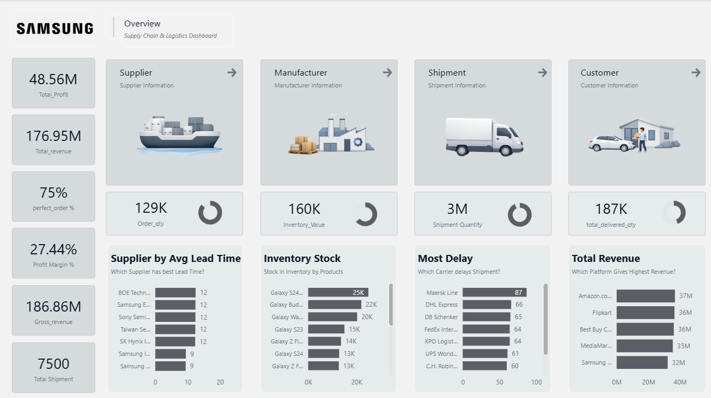
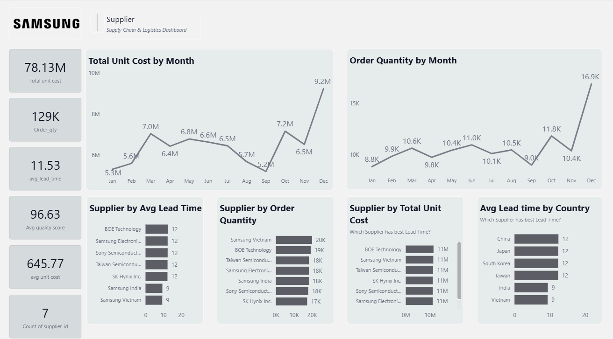

# supply-chain-analytics-powerbi
Power BI dashboard analyzing supplier performance, cost trends, and supply chain efficiency.

# Supply Chain Analytics Dashboard (Power BI)

## Overview

This project presents an end-to-end supply chain analytics dashboard built using Power BI. It provides a comprehensive overview of supplier performance, inventory distribution, shipment efficiency, and customer delivery metrics, along with a detailed supplier-level analysis.

## Objectives

* Analyze supplier efficiency using lead time, order volume, and unit cost
* Monitor inventory distribution across products
* Evaluate shipment performance and delays
* Track overall business KPIs and trends

## Dashboard Highlights

* KPI Overview (Revenue, Profit, Orders, Margin)
* Inventory & Shipment Overview
* Customer Delivery Metrics
* Supplier Deep-Dive Analysis
* Monthly Trends (Unit Cost & Order Quantity)

## Dashboard Preview

## Key Insights

* High-volume suppliers do not always have the lowest lead times, indicating efficiency gaps
* Certain products dominate inventory levels, suggesting potential overstock risks
* Shipment delays vary across carriers, highlighting logistics inefficiencies
* Unit costs show an upward trend toward the end of the year

## Tools Used

* Power BI
* DAX
* Data Modeling

Would appreciate feedback!
